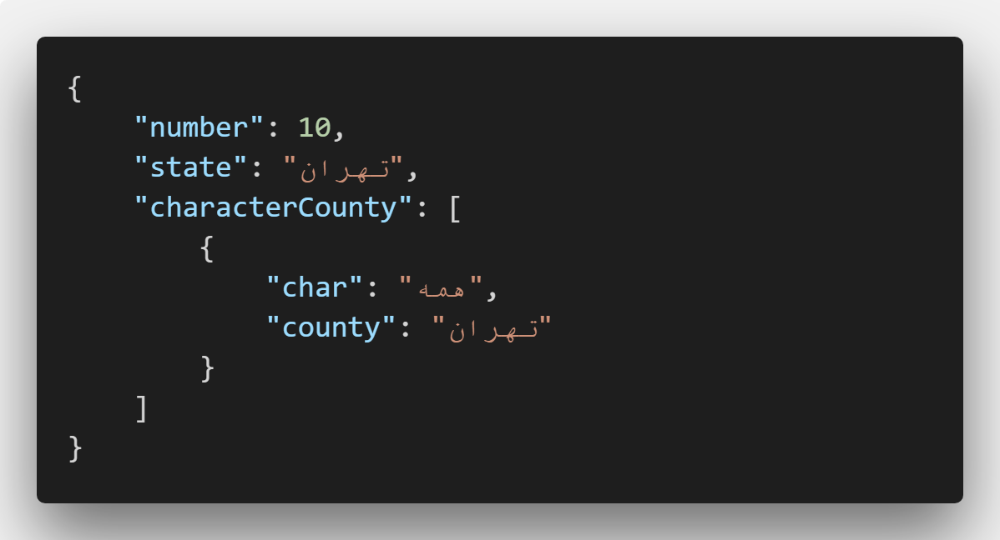
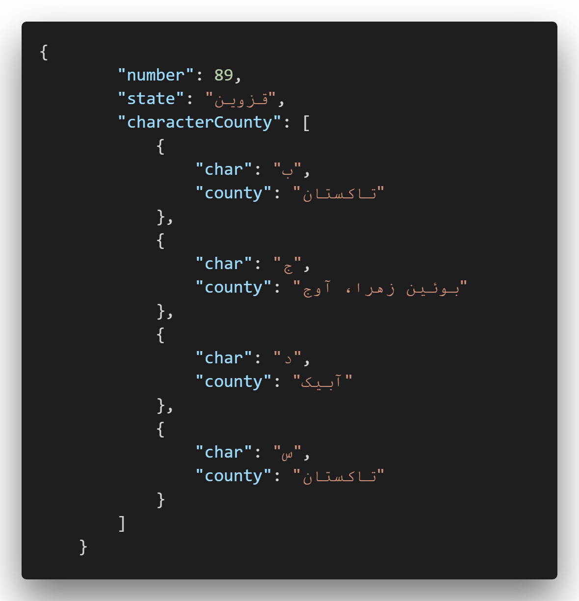

# IranNumberPlate
This a full list of Iran vehicle number plates gathered from many different sources with great help of "@RezaRasoulzadeh".   

# :dizzy_face: Usage

Each province in Iran has multiple unique, two-digit codes that are included at the right end of the license plates in a distinguished square outline. 

The order of letter in the plates follows the alphabetical order of the Persian alphabet, and excludes letters reserved for special license plates. The order is as follows:

- ب
- ج
- د
- س
- ص
- ط
- ق
- ل
- م
- ن
- و
- ه
- ی

In order to reduce file size, we decided to merge all letters if all of them are for same county. you can see merged example here:

and normal one here:

